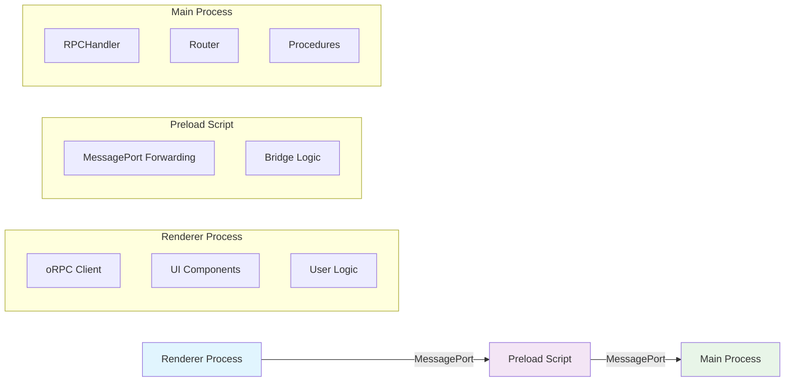
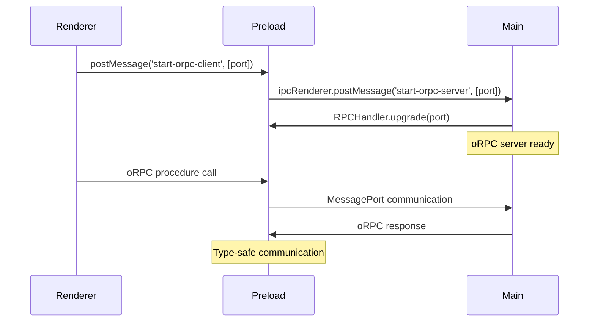

# oRPC Guide for Electron

> [!IMPORTANT] **Comprehensive Guide**: This guide demonstrates how to use [oRPC](https://orpc.unnoq.com) (OpenAPI Remote Procedure Call) in Electron applications for **type-safe inter-process communication** between the main and renderer processes.

[!NOTE] **Race Condition Solution**: This guide includes a detailed analysis of how to eliminate race conditions in oRPC Electron applications - see the [Race Condition Analysis](#race-condition-analysis-historical-evolution) section.

---

## Table of Contents

1. [Overview](#overview)
2. [Installation](#installation)
3. [Architecture](#architecture)
4. [Defining Procedures](#defining-procedures)
5. [Creating Router](#creating-router)
6. [Server Setup (Main Process)](#server-setup-main-process)
7. [Client Setup (Renderer Process)](#client-setup-renderer-process)
8. [Preload Bridge](#preload-bridge)
9. [Type Safety](#type-safety)
10. [Usage Examples](#usage-examples)
11. [Best Practices](#best-practices)
12. [Race Condition Analysis: Historical Evolution](#race-condition-analysis-historical-evolution)
13. [Testing oRPC Functionality](#testing-orpc-functionality)
14. [Troubleshooting](#troubleshooting)
15. [References](#references)

## Overview

oRPC combines RPC (Remote Procedure Call) with OpenAPI, allowing you to define and call remote procedures through a type-safe API. In Electron applications, oRPC enables:

### Key Benefits

| Feature | Description |
|---------|-------------|
| **Type Safety** | Full TypeScript support with compile-time type checking |
| **Structured API** | Organized procedures in logical namespaces |
| **Async/Await** | Modern promise-based communication patterns |
| **Validation** | Automatic schema validation (Zod, etc.) |
| **Error Handling** | Built-in error propagation and handling |
| **Developer Experience** | Full IDE support with autocomplete |

### Benefits Over Traditional IPC

| Feature | Traditional IPC | oRPC |
|---------|----------------|------|
| Type Safety | Runtime errors only | Compile-time type checking |
| API Structure | String-based channels | Organized namespaces |
| Validation | Manual implementation | Automatic schema validation |
| Error Handling | Manual error propagation | Built-in error handling |
| Development Experience | Basic debugging | Full IDE support |

### Benefits Over Traditional IPC

| Feature | Traditional IPC | oRPC |
|---------|----------------|------|
| Type Safety | Runtime errors only | Compile-time type checking |
| API Structure | String-based channels | Organized namespaces |
| Validation | Manual implementation | Automatic schema validation |
| Error Handling | Manual error propagation | Built-in error handling |
| Development Experience | Basic debugging | Full IDE support |

## Installation

Install oRPC packages using your preferred package manager:

### Package Installation

```bash
# npm
npm install @orpc/server@latest @orpc/client@latest

# pnpm
pnpm add @orpc/server@latest @orpc/client@latest

# yarn
yarn add @orpc/server@latest @orpc/client@latest
```

### MessagePort Adapter

> [!NOTE] **Built-in Support**: The MessagePort adapter is included in oRPC packages - no additional installation needed.

```bash
# The MessagePort adapter is included in @orpc/server and @orpc/client
# No additional installation needed
```

### Quick Start

After installation, you can immediately start using oRPC in your Electron application. Follow the [Architecture](#architecture) section for setup details.

## Architecture

> [!IMPORTANT] **Three-Process Communication**: oRPC in Electron follows a secure three-process architecture using MessagePort for communication.

### Communication Flow Diagram



### Step-by-Step Communication

1. **Initialization**: Renderer creates MessageChannel and sends one port to main process via preload
2. **Request**: Renderer calls oRPC procedure → MessagePort → Main process
3. **Processing**: Main process executes procedure with validation
4. **Response**: Result returns through MessagePort to renderer
5. **Type Safety**: Shared TypeScript types ensure compile-time checking

### Security Benefits

- **Isolated Processes**: Renderer cannot directly access main process
- **Type-Safe Bridge**: Preload script provides secure communication
- **Validated Data**: All inputs validated before processing
- **Structured Communication**: Organized namespaces prevent channel conflicts

## Defining Procedures

Procedures are defined using the `os` (oRPC Server) builder pattern. We'll use Zod for schema validation (any standard schema is supported).

### Basic Procedure

```typescript
import { os } from '@orpc/server'
import { z } from 'zod'

// Simple procedure with input validation
export const getUser = os
  .input(z.object({
    id: z.number().int().min(1)
  }))
  .handler(async ({ input }) => {
    // Your business logic here
    return {
      id: input.id,
      name: 'John Doe',
      email: 'john@example.com'
    }
  })
```

### Procedure Without Input

```typescript
export const getCurrentTime = os
  .handler(async () => {
    return {
      timestamp: Date.now(),
      iso: new Date().toISOString()
    }
  })
```

### Procedure with Context

```typescript
import type { IncomingHttpHeaders } from 'node:http'
import { ORPCError } from '@orpc/server'

export const createUser = os
  .$context<{ headers: IncomingHttpHeaders }>()
  .use(({ context, next }) => {
    const token = context.headers.authorization?.split(' ')[1]
    if (!token) {
      throw new ORPCError('UNAUTHORIZED')
    }
    return next({ context: { user: parseToken(token) } })
  })
  .input(z.object({
    name: z.string(),
    email: z.string().email()
  }))
  .handler(async ({ input, context }) => {
    // context.user is available here
    return { id: 1, ...input }
  })
```

### Error Handling

```typescript
import { ORPCError } from '@orpc/server'

export const deleteUser = os
  .input(z.object({ id: z.number() }))
  .handler(async ({ input }) => {
    const user = await findUser(input.id)
    if (!user) {
      throw new ORPCError('NOT_FOUND', 'User not found')
    }
    await removeUser(input.id)
    return { success: true }
  })
```

## Creating Router

Organize procedures into logical namespaces by creating a router object:

```typescript
import { os } from '@orpc/server'
import { z } from 'zod'

// Define schemas
const UserSchema = z.object({
  id: z.number().int().min(1),
  name: z.string(),
  email: z.string().email()
})

// Define procedures
export const listUsers = os
  .input(z.object({
    limit: z.number().int().min(1).max(100).optional(),
    cursor: z.number().int().min(0).default(0)
  }))
  .handler(async ({ input }) => {
    // Implementation
    return [{ id: 1, name: 'John', email: 'john@example.com' }]
  })

export const getUser = os
  .input(UserSchema.pick({ id: true }))
  .handler(async ({ input }) => {
    // Implementation
    return { id: input.id, name: 'John', email: 'john@example.com' }
  })

export const createUser = os
  .input(UserSchema.omit({ id: true }))
  .handler(async ({ input }) => {
    // Implementation
    return { id: 1, ...input }
  })

// Create router with namespaces
export const router = {
  user: {
    list: listUsers,
    get: getUser,
    create: createUser
  },
  system: {
    ping: os.handler(async () => 'pong'),
    health: os.handler(async () => ({ status: 'ok' }))
  }
}

// Export router type for client
export type Router = typeof router
```

## Server Setup (Main Process)

> [!WARNING] **Critical**: Set up oRPC server **before creating windows** to eliminate race conditions.

### Complete Server Setup

```typescript
// src/main/index.ts
import { app, BrowserWindow, ipcMain } from 'electron'
import { router } from './api'

// Set up oRPC MessagePort communication BEFORE creating windows
// This ensures that listener is ready when the renderer sends the port
let orpcHandler: any = null
import('@orpc/server/message-port').then(({ RPCHandler }) => {
  const { onError } = require('@orpc/server')

  orpcHandler = new RPCHandler(router, {
    interceptors: [
      onError((error: any) => {
        console.error('[orpc-server] Error:', error)
      }),
    ],
  })

  // Listen for port sent from renderer via preload
  ipcMain.on('start-orpc-server', async (event) => {
    const [serverPort] = event.ports
    if (!orpcHandler) {
      console.error('[orpc-server] Handler not initialized yet, but received port')
      return
    }
    orpcHandler.upgrade(serverPort)
    serverPort.start()
  })
}).catch((error) => {
  console.error('[orpc-server] Failed to initialize oRPC server:', error)
})

function createWindow(): void {
  const mainWindow = new BrowserWindow({
    webPreferences: {
      preload: join(__dirname, '../preload/index.mjs'),
      sandbox: false
    }
  })

  mainWindow.loadFile('index.html')
}

app.whenReady().then(() => {
  createWindow()
})
```

### Key Improvements

| Aspect | ❌ Old Approach | ✅ New Approach |
|--------|----------------|----------------|
| **Initialization Order** | Server setup in `createWindow()` | Server setup **before** `createWindow()` |
| **Race Condition Risk** | High (window might send port before server ready) | **Eliminated** (server ready before any communication) |
| **Error Handling** | Basic error logging | Enhanced with safety checks |
| **Debugging** | Hard to debug timing issues | Clear error messages and state tracking |

### Error Interceptors

Add global error handling:

```typescript
import { onError } from '@orpc/server'

const handler = new RPCHandler(router, {
  interceptors: [
    onError((error) => {
      console.error('oRPC Error:', error)

      // Send to error tracking service
      if (process.env.NODE_ENV === 'production') {
        errorTracker.captureException(error)
      }
    })
  ]
})
```

### Error Interceptors

Add global error handling:

```typescript
import { onError } from '@orpc/server'

const handler = new RPCHandler(router, {
  interceptors: [
    onError((error) => {
      // Log errors
      console.error('oRPC Error:', error)
      
      // Send to error tracking service
      if (process.env.NODE_ENV === 'production') {
        errorTracker.captureException(error)
      }
    })
  ]
})
```

## Client Setup (Renderer Process)

> [!SUCCESS] **Race-Condition-Free**: Create oRPC client using the MessagePort adapter with **synchronous imports** to eliminate race conditions.

### Complete Client Setup

```typescript
// src/renderer/src/utils/orpc-client.ts
import type { RouterClient } from '@orpc/server'
import type { router } from '../../../main/api'
import { createORPCClient } from '@orpc/client'
import { RPCLink } from '@orpc/client/message-port'

// Create MessageChannel for communication
const channel = new MessageChannel()
const clientPort = channel.port1
const serverPort = channel.port2

// Send serverPort to preload script
window.postMessage('start-orpc-client', '*', [serverPort])

// Create link and client - official oRPC pattern
const link = new RPCLink({
  port: clientPort
})

clientPort.start()

// Export client directly - createORPCClient handles initialization internally
export const orpc: RouterClient<typeof router> = createORPCClient(link) as RouterClient<typeof router>

// Mocking support for tests
export function setMockTestServiceHealth(mock: ((input: { serviceUrl: string; healthCheckUrl?: string }) => Promise<any>) | null) {
  if (orpc?.svc) {
    orpc.svc.testServiceHealth = mock as any
  }
}

// Listen for mock updates from tests (set before module loads)
if (typeof window !== 'undefined') {
  const windowMock = (window as any).__mockTestServiceHealth
  if (windowMock && orpc?.svc) {
    orpc.svc.testServiceHealth = windowMock
  }

  ;(window as any).__setMockTestServiceHealth = (mock: any) => {
    if (orpc?.svc) {
      orpc.svc.testServiceHealth = mock
    }
  }
}
```

### Architecture Comparison

| Component | ❌ Old Async Approach | ✅ New Sync Approach |
|----------|---------------------|---------------------|
| **Imports** | `await import()` | Synchronous `import` |
| **Initialization** | Complex proxy with promises | Direct client export |
| **Race Conditions** | Possible | **Eliminated** |
| **Code Complexity** | High (50+ lines) | Low (25 lines) |
| **Error Handling** | Manual "not ready" errors | Built-in to oRPC client |
| **Testing** | Requires waiting mechanisms | Direct usage |

### Key Benefits

- **No Race Conditions**: Client available immediately
- **Simpler Code**: No complex proxy logic
- **Type Safety**: Maintained with simpler implementation
- **Test-Friendly**: Easy to mock without initialization complexity
- **Performance**: No unnecessary waiting or overhead

## Preload Bridge

> [!SECURITY] **Secure Bridge**: The preload script acts as a secure bridge, forwarding MessagePort between renderer and main processes.

### Complete Preload Setup

```typescript
// src/preload/index.ts
import { contextBridge, ipcRenderer } from 'electron'

// Forward serverPort from renderer to main process
window.addEventListener('message', (event) => {
  if (event.data === 'start-orpc-client') {
    const [serverPort] = event.ports
    ipcRenderer.postMessage('start-orpc-server', null, [serverPort])
  }
})

// Optional: Expose other APIs via contextBridge
contextBridge.exposeInMainWorld('electron', {
  // Other Electron APIs
})
```

### Security Benefits

| Aspect | Description |
|--------|-------------|
| **Isolation** | Renderer cannot directly access main process |
| **MessagePort** | Secure communication channel between processes |
| **Context Bridge** | Controlled API exposure to renderer |
| **Validation** | All communication goes through oRPC validation |

### Security Benefits

| Aspect | Description |
|--------|-------------|
| **Isolation** | Renderer cannot directly access main process |
| **MessagePort** | Secure communication channel between processes |
| **Context Bridge** | Controlled API exposure to renderer |
| **Validation** | All communication goes through oRPC validation |

### Communication Flow



## Type Safety

oRPC provides end-to-end type safety. The client automatically infers types from the router:

```typescript
import type { RouterClient } from '@orpc/server'
import type { router } from '../../../main/api'

// Client is fully typed
const client: RouterClient<typeof router> = orpc

// TypeScript knows the exact shape
const users = await client.user.list({ limit: 10 })
// Type: { id: number; name: string; email: string }[]

const user = await client.user.get({ id: 1 })
// Type: { id: number; name: string; email: string }

// Type errors caught at compile time
await client.user.get({ id: 'invalid' }) // ❌ Type error
```

### Inferring Return Types

```typescript
import type { Router } from '../../../main/api'

// Infer return type of a procedure
type UserListResult = Awaited<ReturnType<Router['user']['list']>>
// Type: { id: number; name: string; email: string }[]
```

## Usage Examples

### Basic Procedure Call

```typescript
import { orpc } from '../utils/orpc-client'

// Direct call - no waiting required
const users = await orpc.user.list({ limit: 10 })
console.log('Users:', users)
```

### Nested Namespace Access

```typescript
// Access nested procedures
const user = await orpc.user.get({ id: 1 })
const health = await orpc.system.health()
const pong = await orpc.system.ping()
```

### Error Handling

```typescript
import { ORPCError } from '@orpc/server'

try {
  const user = await orpc.user.get({ id: 999 })
} catch (error) {
  if (error instanceof ORPCError) {
    if (error.code === 'NOT_FOUND') {
      console.error('User not found')
    } else {
      console.error('Error:', error.message)
    }
  } else {
    console.error('Unexpected error:', error)
  }
}
```

### React Component Example

```typescript
import { useEffect, useState } from 'react'
import { orpc } from '../utils/orpc-client'

function UserList() {
  const [users, setUsers] = useState([])
  const [loading, setLoading] = useState(true)

  useEffect(() => {
    const loadUsers = async () => {
      try {
        // Direct call - no waiting required
        const data = await orpc.user.list({ limit: 10 })
        setUsers(data)
      } catch (error) {
        console.error('Failed to load users:', error)
      } finally {
        setLoading(false)
      }
    }
    loadUsers()
  }, [])

  if (loading) return <div>Loading...</div>

  return (
    <ul>
      {users.map(user => (
        <li key={user.id}>{user.name}</li>
      ))}
    </ul>
  )
}
```

## Electron Store Integration

Electron applications often need persistent data storage. The recommended approach is to expose all store operations through oRPC procedures, ensuring type safety and centralized access control.

### Why Use oRPC for Store Operations?

- **Type Safety**: Full TypeScript support across processes
- **Centralized Access**: All store operations go through main process
- **Security**: Renderer process cannot directly access file system
- **Consistency**: Same pattern as other IPC operations
- **Validation**: Input validation before store operations

### Setting Up Store Procedures

In your main process, create oRPC procedures for store operations:

```typescript
// src/main/api.ts
import { os } from '@orpc/server'
import { z } from 'zod'
import Store from 'electron-store'

// Define store configuration type
type StoreConfig = {
  selectedDirectory?: string
  defaultDataPath?: string
  userId?: string
  preferences?: {
    theme: 'light' | 'dark'
    language: string
  }
}

// Initialize store in main process
const store = new Store<StoreConfig>({
  name: 'app-config',
  defaults: {
    preferences: {
      theme: 'light',
      language: 'en'
    }
  }
})

// Define store key constants
const STORE_KEYS = {
  SELECTED_DIRECTORY: 'selectedDirectory',
  DEFAULT_DATA_PATH: 'defaultDataPath',
  USER_ID: 'userId',
  PREFERENCES: 'preferences'
} as const

// Store procedures
export const getStoreValue = os
  .input(z.string())
  .handler(async ({ input: key }) => {
    return store.get(key as keyof StoreConfig)
  })

export const setStoreValue = os
  .input(z.object({
    key: z.string(),
    value: z.any()
  }))
  .handler(async ({ input: { key, value } }) => {
    store.set(key as keyof StoreConfig, value)
    return true
  })

export const hasStoreValue = os
  .input(z.string())
  .handler(async ({ input: key }) => {
    return store.has(key as keyof StoreConfig)
  })

export const deleteStoreValue = os
  .input(z.string())
  .handler(async ({ input: key }) => {
    store.delete(key as keyof StoreConfig)
    return true
  })

// Add to router
export const router = {
  store: {
    get: getStoreValue,
    set: setStoreValue,
    has: hasStoreValue,
    delete: deleteStoreValue
  },
  // ... other namespaces
}
```

### Type-Safe Store Wrapper in Renderer

Create a type-safe wrapper in the renderer process:

```typescript
// src/renderer/src/utils/store.ts
import { orpc } from './orpc-client'
import type { StoreConfig } from '../../../main/types'

// Type-safe store wrapper
export const electronStore = {
  get: async <K extends keyof StoreConfig>(
    key: K
  ): Promise<StoreConfig[K] | undefined> => {
    return await orpc.store.get(key) as StoreConfig[K] | undefined
  },

  set: async <K extends keyof StoreConfig>(
    key: K,
    value: StoreConfig[K]
  ): Promise<void> => {
    await orpc.store.set({ key, value })
  },

  has: async <K extends keyof StoreConfig>(key: K): Promise<boolean> => {
    return await orpc.store.has(key)
  },

  delete: async <K extends keyof StoreConfig>(key: K): Promise<void> => {
    await orpc.store.delete(key)
  }
}

export default electronStore
```

### Store Usage Examples

```typescript
// In renderer component
import electronStore from '../utils/store'

// Get store value
const directory = await electronStore.get('selectedDirectory')
if (directory) {
  console.log('Saved directory:', directory)
}

// Set store value
await electronStore.set('selectedDirectory', '/path/to/data')
await electronStore.set('preferences', {
  theme: 'dark',
  language: 'en'
})

// Check if key exists
const hasDirectory = await electronStore.has('selectedDirectory')

// Delete store value
await electronStore.delete('selectedDirectory')
```

### React Hook Example

```typescript
// src/renderer/src/hooks/useStore.ts
import { useState, useEffect } from 'react'
import electronStore from '../utils/store'

export function useStore<K extends keyof StoreConfig>(key: K) {
  const [value, setValue] = useState<StoreConfig[K] | undefined>()
  const [loading, setLoading] = useState(true)

  useEffect(() => {
    const loadValue = async () => {
      try {
        const stored = await electronStore.get(key)
        setValue(stored)
      } catch (error) {
        console.error(`Failed to load ${key}:`, error)
      } finally {
        setLoading(false)
      }
    }
    loadValue()
  }, [key])

  const updateValue = async (newValue: StoreConfig[K]) => {
    try {
      await electronStore.set(key, newValue)
      setValue(newValue)
    } catch (error) {
      console.error(`Failed to save ${key}:`, error)
    }
  }

  return { value, loading, setValue: updateValue }
}

// Usage
function SettingsComponent() {
  const { value: theme, setValue: setTheme } = useStore('preferences')
  
  return (
    <select 
      value={theme?.theme || 'light'}
      onChange={(e) => setTheme({ ...theme, theme: e.target.value })}
    >
      <option value="light">Light</option>
      <option value="dark">Dark</option>
    </select>
  )
}
```

## Complete IPC Migration

**Important**: oRPC should handle ALL communication between the renderer and main processes. This includes:

- File system operations
- Store operations (electron-store)
- Window management
- Native dialogs
- System information
- Any other IPC communication

### Why Use oRPC for Everything?

1. **Consistency**: Single communication pattern across the application
2. **Type Safety**: End-to-end type safety for all operations
3. **Maintainability**: Easier to understand and maintain
4. **Security**: Centralized access control in main process
5. **Testing**: Easier to mock and test

### Migration from Traditional IPC

#### Before (Traditional IPC)

```typescript
// Main process
ipcMain.handle('get-store-value', async (event, key) => {
  return store.get(key)
})

ipcMain.handle('set-store-value', async (event, key, value) => {
  store.set(key, value)
})

// Renderer process
const directory = await window.electron.invoke('get-store-value', 'selectedDirectory')
await window.electron.invoke('set-store-value', 'selectedDirectory', '/path')
```

#### After (oRPC)

```typescript
// Main process - Define procedures
export const getStoreValue = os
  .input(z.string())
  .handler(async ({ input: key }) => {
    return store.get(key)
  })

export const setStoreValue = os
  .input(z.object({ key: z.string(), value: z.any() }))
  .handler(async ({ input: { key, value } }) => {
    store.set(key, value)
    return true
  })

// Add to router
export const router = {
  store: {
    get: getStoreValue,
    set: setStoreValue
  }
}

// Renderer process - Type-safe calls
const directory = await orpc.store.get('selectedDirectory')
await orpc.store.set({ key: 'selectedDirectory', value: '/path' })
```

### Migration Checklist

1. ✅ **Identify all IPC handlers**: List all `ipcMain.handle` and `ipcMain.on` calls
2. ✅ **Create oRPC procedures**: Convert each handler to an oRPC procedure
3. ✅ **Organize into router**: Group related procedures into namespaces
4. ✅ **Update renderer calls**: Replace `window.electron.invoke()` with oRPC calls
5. ✅ **Remove old IPC**: Delete deprecated IPC handlers
6. ✅ **Update tests**: Mock oRPC instead of IPC
7. ✅ **Verify type safety**: Ensure all calls are type-checked

### Common Migration Patterns

| Traditional IPC | oRPC Equivalent |
|----------------|-----------------|
| `ipcMain.handle('fs:read', handler)` | `orpc.fs.readFile()` |
| `ipcMain.handle('store:get', handler)` | `orpc.store.get()` |
| `ipcMain.handle('dialog:open', handler)` | `orpc.dialog.open()` |
| `ipcMain.on('window:maximize', handler)` | `orpc.window.maximize()` |

### Avoiding Direct Store Access

```typescript
// ❌ Bad - Direct store access in renderer (not possible, but avoid IPC workarounds)
// Don't create IPC handlers just for store access

// ✅ Good - All store access through oRPC
await orpc.store.get('selectedDirectory')
await orpc.store.set({ key: 'selectedDirectory', value: '/path' })
```

## Best Practices

> [!IMPORTANT] **Current Architecture**: These practices reflect on race-condition-free implementation.

### 1. Use Direct Calls (No Waiting Required)

```typescript
// ✅ Good - Current architecture
const result = await orpc.user.list({})

// ❌ Bad - Old pattern, no longer needed
await orpcReady
const result = await orpc.user.list({})
```

> [!NOTE] **Why This Works**: The new architecture eliminates race conditions through synchronous imports and direct client export.

### 2. Use Type-Safe Router Imports

```typescript
// ✅ Good - Import router type from server
import type { router } from '../../../main/api'
import type { RouterClient } from '@orpc/server'

export const orpc: RouterClient<typeof router> = createORPCClient(link)

// ❌ Bad - Don't manually type the client
export const orpc: any = createORPCClient(link)
```

### 3. Organize Procedures into Namespaces

```typescript
// ✅ Good - Organized by domain
export const router = {
  user: { list, get, create, update, delete },
  post: { list, get, create, update, delete },
  system: { ping, health }
}

// ❌ Bad - Flat structure
export const router = {
  listUsers, getUser, createUser, listPosts, getPost, ...
}
```

### 4. Use Schema Validation

```typescript
// ✅ Good - Validate inputs
export const createUser = os
  .input(z.object({
    name: z.string().min(1),
    email: z.string().email()
  }))
  .handler(async ({ input }) => {
    // Input is validated and typed
  })

// ❌ Bad - No validation
export const createUser = os
  .handler(async ({ input }: { input: any }) => {
    // No type safety or validation
  })
```

### 5. Handle Errors Appropriately

```typescript
// ✅ Good - Specific error handling
try {
  const user = await orpc.user.get({ id: 1 })
} catch (error) {
  if (error instanceof ORPCError) {
    // Handle oRPC errors
  } else {
    // Handle unexpected errors
  }
}
```

### 6. Use Context for Shared Data

```typescript
// ✅ Good - Use context for authentication, etc.
export const createPost = os
  .$context<{ user: User }>()
  .use(({ context, next }) => {
    if (!context.user) {
      throw new ORPCError('UNAUTHORIZED')
    }
    return next()
  })
  .handler(async ({ input, context }) => {
    // context.user is available
  })
```

### 7. Use oRPC for ALL IPC Communication

```typescript
// ✅ Good - All communication through oRPC
await orpc.store.get('key')
await orpc.fs.readFile('path')
await orpc.dialog.showOpenDialog({})

// ❌ Bad - Mixing traditional IPC with oRPC
await window.electron.invoke('get-store-value', 'key') // Don't do this
await orpc.store.get('key') // Use oRPC instead
```

### 8. Expose Store Operations Through oRPC

```typescript
// ✅ Good - Store operations via oRPC procedures
export const router = {
  store: {
    get: getStoreValue,
    set: setStoreValue,
    has: hasStoreValue,
    delete: deleteStoreValue
  }
}

// ❌ Bad - Direct store access from renderer (not possible, but avoid IPC workarounds)
// Don't create separate IPC handlers for store operations
```

### 9. Create Type-Safe Store Wrappers

```typescript
// ✅ Good - Type-safe wrapper in renderer (current architecture)
export const electronStore = {
  get: async <K extends keyof StoreConfig>(key: K) => {
    return await orpc.store.get(key) as StoreConfig[K] | undefined
  },
  set: async <K extends keyof StoreConfig>(key: K, value: StoreConfig[K]) => {
    await orpc.store.set({ key, value })
  }
}

// ❌ Bad - Old pattern with manual waiting
export const electronStore = {
  get: async <K extends keyof StoreConfig>(key: K) => {
    await orpcReady  // No longer needed
    return await orpc.store.get(key) as StoreConfig[K] | undefined
  }
}

// ❌ Bad - Direct oRPC calls without type safety
const value = await orpc.store.get('someKey') // No type checking
```

## Testing oRPC Functionality

Comprehensive testing is crucial for ensuring oRPC works correctly in your Electron application. **The goal of testing is to find bugs and break the system, not just validate that current code works.** This section covers testing strategies that provoke errors, test edge cases, and verify that the system handles failures gracefully.

### Testing Philosophy

Good tests should:
- **Provoke errors**: Try to break the system intentionally
- **Test real scenarios**: Use actual MessagePort and real communication, not just mocks
- **Find edge cases**: Test null, undefined, huge payloads, circular references
- **Test race conditions**: Verify timing issues with real delays, not mocked ones
- **Verify error handling**: Ensure errors propagate correctly and are handled gracefully
- **Test type safety**: Use TypeScript compiler to verify compile-time type checking
- **Test integration**: Test actual Electron process communication when possible

**Avoid tests that only validate current behavior** - these don't find bugs, they just confirm what you already know works.

### Test Setup

Install testing dependencies:

```bash
npm install -D vitest @vitest/ui
```

Create a test configuration:

```typescript
// vitest.config.ts
import { defineConfig } from 'vitest/config'

export default defineConfig({
  test: {
    environment: 'node',
    globals: true
  }
})
```

### Type Safety Tests

Type safety is one of oRPC's key features. **Test actual TypeScript compilation, not just mock behavior.** Use `@ts-expect-error` to verify TypeScript catches type errors at compile time.

#### Testing Compile-Time Type Safety

```typescript
// src/renderer/src/utils/orpc-type-safety.test.ts
import { describe, it, expect, vi } from 'vitest'
import type { RouterClient } from '@orpc/server'
import type { router } from '../../../main/api'

// Mock oRPC client with proper types
const createMockOrpcClient = (): RouterClient<typeof router> => ({
  user: {
    list: vi.fn().mockResolvedValue([{ id: 1, name: 'John', email: 'john@example.com' }]),
    get: vi.fn().mockResolvedValue({ id: 1, name: 'John', email: 'john@example.com' }),
    create: vi.fn().mockResolvedValue({ id: 1, name: 'John', email: 'john@example.com' })
  },
  store: {
    get: vi.fn().mockResolvedValue('value'),
    set: vi.fn().mockResolvedValue(true),
    has: vi.fn().mockResolvedValue(true),
    delete: vi.fn().mockResolvedValue(true)
  }
} as RouterClient<typeof router>)

describe('oRPC Type Safety - Compile-Time Checking', () => {
  it('should reject invalid parameter types at compile time', () => {
    const orpc = createMockOrpcClient()
    
    // ✅ Good - Use @ts-expect-error to verify TypeScript catches errors
    // @ts-expect-error - TypeScript should catch this: id should be number, not string
    const invalidCall1 = orpc.user.get({ id: 'invalid' })
    
    // @ts-expect-error - TypeScript should catch this: limit should be number, not string
    const invalidCall2 = orpc.user.list({ limit: 'invalid' })
    
    // @ts-expect-error - TypeScript should catch this: key should be string, not number
    const invalidCall3 = orpc.store.get(123)
    
    // If these compile without @ts-expect-error, type safety is broken
    expect(true).toBe(true) // Test passes if TypeScript compilation fails
  })

  it('should enforce correct parameter types', async () => {
    const orpc = createMockOrpcClient()
    
    // ✅ These should work - correct types
    await orpc.user.get({ id: 1 })
    await orpc.user.list({ limit: 10 })
    await orpc.store.get('selectedDirectory')
    
    expect(orpc.user.get).toHaveBeenCalledWith({ id: 1 })
  })

  it('should infer correct return types', async () => {
    const orpc = createMockOrpcClient()
    
    const user = await orpc.user.get({ id: 1 })
    // Type: { id: number; name: string; email: string }
    expect(user).toHaveProperty('id')
    expect(user).toHaveProperty('name')
    expect(user).toHaveProperty('email')
    
    const users = await orpc.user.list({ limit: 10 })
    // Type: { id: number; name: string; email: string }[]
    expect(Array.isArray(users)).toBe(true)
  })

  it('should enforce nested namespace types', async () => {
    const orpc = createMockOrpcClient()
    
    // ✅ Correct nested access
    const value = await orpc.store.get('selectedDirectory')
    await orpc.store.set({ key: 'selectedDirectory', value: '/path' })
    
    expect(orpc.store.get).toHaveBeenCalledWith('selectedDirectory')
  })

  it('should reject invalid router structure at compile time', () => {
    // @ts-expect-error - TypeScript should catch missing required procedures
    const invalidRouter: RouterClient<typeof router> = {
      user: {
        list: vi.fn(),
        // Missing 'get' and 'create' procedures
      }
    }
    
    // If this compiles, type safety is broken
    expect(true).toBe(true)
  })
})
```

#### Testing Runtime Type Validation

While compile-time type safety is primary, also test runtime validation when using Zod schemas:

```typescript
describe('oRPC Type Safety - Runtime Validation', () => {
  it('should reject invalid input at runtime with Zod validation', async () => {
    const orpc = createMockOrpcClient()
    
    // Even if TypeScript allows it (with type assertion), Zod should catch it
    await expect(
      orpc.user.get({ id: 'invalid' as any })
    ).rejects.toThrow() // Zod validation should reject string instead of number
  })
})
```

### Timing and Initialization Tests

**Test that oRPC works correctly without race conditions.** The current architecture should not require any waiting mechanisms.

#### Testing Direct Client Usage

```typescript
// src/renderer/src/utils/orpc-timing.test.ts
import { describe, it, expect, vi, beforeEach } from 'vitest'
import { orpc } from './orpc-client'

describe('oRPC Timing and Initialization - Current Architecture', () => {
  beforeEach(() => {
    vi.clearAllMocks()
  })

  it('should work immediately without waiting', async () => {
    // ✅ Good - Current architecture should work immediately
    const mockClient = {
      user: {
        list: vi.fn().mockResolvedValue([{ id: 1, name: 'John' }])
      }
    }
    
    vi.mock('./orpc-client', () => ({
      orpc: mockClient
    }))
    
    const { orpc: testOrpc } = await import('./orpc-client')
    
    // Should work immediately - no waiting required
    const result = await testOrpc.user.list({})
    expect(result).toEqual([{ id: 1, name: 'John' }])
    expect(mockClient.user.list).toHaveBeenCalled()
  })

  it('should handle concurrent calls without race conditions', async () => {
    // Multiple components calling simultaneously
    const mockClient = {
      user: {
        list: vi.fn().mockResolvedValue([{ id: 1, name: 'John' }])
      }
    }
    
    vi.mock('./orpc-client', () => ({
      orpc: mockClient
    }))
    
    const { orpc: testOrpc } = await import('./orpc-client')
    
    // Fire multiple calls simultaneously
    const calls = Array.from({ length: 10 }, () => testOrpc.user.list({}))
    
    const results = await Promise.all(calls)
    
    // All should succeed
    expect(results).toHaveLength(10)
    expect(results.every(r => r.length === 1)).toBe(true)
    expect(mockClient.user.list).toHaveBeenCalledTimes(10)
  })

  it('should handle rapid successive calls', async () => {
    const mockClient = {
      user: {
        list: vi.fn().mockResolvedValue([{ id: 1, name: 'John' }])
      }
    }
    
    vi.mock('./orpc-client', () => ({
      orpc: mockClient
    }))
    
    const { orpc: testOrpc } = await import('./orpc-client')
    
    // Fire calls rapidly one after another
    for (let i = 0; i < 100; i++) {
      await testOrpc.user.list({})
    }
    
    // All should complete successfully
    expect(mockClient.user.list).toHaveBeenCalledTimes(100)
  })

  it('should maintain type safety without initialization complexity', async () => {
    // Verify that the simplified architecture maintains type safety
    const mockClient = {
      user: {
        list: vi.fn().mockResolvedValue([{ id: 1, name: 'John' }])
      }
    }
    
    vi.mock('./orpc-client', () => ({
      orpc: mockClient
    }))
    
    const { orpc: testOrpc } = await import('./orpc-client')
    
    // TypeScript should enforce correct types
    const result = await testOrpc.user.list({ limit: 10 })
    expect(result).toEqual([{ id: 1, name: 'John' }])
    
    // @ts-expect-error - Should catch type errors at compile time
    // await testOrpc.user.list({ limit: 'invalid' })
  })
})
```

### Component Readiness Tests

**Test that oRPC components initialize correctly with the new architecture.** Verify that all oRPC components (MessageChannel, MessagePort, RPCLink, Client) are properly initialized without complex waiting mechanisms.

```typescript
// src/renderer/src/utils/orpc-readiness.test.ts
import { describe, it, expect, vi, beforeEach } from 'vitest'

describe('oRPC Component Readiness - Current Architecture', () => {
  beforeEach(() => {
    vi.clearAllMocks()
  })

  it('should create MessageChannel synchronously', async () => {
    vi.resetModules()
    const mockMessageChannel = vi.fn(() => ({
      port1: { start: vi.fn(), addEventListener: vi.fn() },
      port2: { start: vi.fn(), addEventListener: vi.fn() }
    }))
    
    Object.defineProperty(global, 'MessageChannel', {
      value: mockMessageChannel,
      writable: true
    })
    
    await import('./orpc-client')
    
    expect(mockMessageChannel).toHaveBeenCalled()
  })

  it('should start MessagePort immediately', async () => {
    vi.resetModules()
    const mockPort = {
      start: vi.fn(),
      addEventListener: vi.fn(),
      postMessage: vi.fn()
    }
    
    class MockMessageChannel {
      port1 = mockPort
      port2 = {}
    }
    
    Object.defineProperty(global, 'MessageChannel', {
      value: MockMessageChannel,
      writable: true
    })
    
    const { orpc } = await import('./orpc-client')
    
    // Port should be started immediately, not after waiting
    expect(mockPort.start).toHaveBeenCalled()
    
    // Client should be available immediately
    expect(orpc).toBeDefined()
  })

  it('should create RPCLink synchronously', async () => {
    vi.resetModules()
    const mockRPCLink = vi.fn()
    
    vi.doMock('@orpc/client/message-port', () => ({
      RPCLink: mockRPCLink
    }))
    
    await import('./orpc-client')
    
    expect(mockRPCLink).toHaveBeenCalled()
  })

  it('should create client immediately', async () => {
    vi.resetModules()
    const mockCreateORPCClient = vi.fn().mockReturnValue({
      user: { list: vi.fn() }
    })
    
    vi.doMock('@orpc/client', () => ({
      createORPCClient: mockCreateORPCClient
    }))
    
    const { orpc } = await import('./orpc-client')
    
    expect(mockCreateORPCClient).toHaveBeenCalled()
    expect(orpc).toBeDefined()
  })

  it('should work without initialization promises', async () => {
    vi.resetModules()
    
    let messageChannelCreated = false
    let portStarted = false
    let linkCreated = false
    let clientCreated = false
    
    // Track component initialization
    class MockMessageChannel {
      port1 = {
        start: vi.fn(() => { portStarted = true }),
        addEventListener: vi.fn()
      }
      port2 = {}
      constructor() {
        messageChannelCreated = true
      }
    }
    
    const mockRPCLink = vi.fn(() => {
      linkCreated = true
      return {}
    })
    
    const mockCreateORPCClient = vi.fn(() => {
      clientCreated = true
      return { user: { list: vi.fn() } }
    })
    
    Object.defineProperty(global, 'MessageChannel', {
      value: MockMessageChannel,
      writable: true
    })
    
    vi.doMock('@orpc/client/message-port', () => ({
      RPCLink: mockRPCLink
    }))
    
    vi.doMock('@orpc/client', () => ({
      createORPCClient: mockCreateORPCClient
    }))
    
    const { orpc } = await import('./orpc-client')
    
    // All components should be initialized immediately
    expect(messageChannelCreated).toBe(true)
    expect(portStarted).toBe(true)
    expect(linkCreated).toBe(true)
    expect(clientCreated).toBe(true)
    
    // Communication should work immediately without waiting
    await orpc.user.list({})
  })
})
```

### React Component Testing

Test React components that use oRPC:

```typescript
// src/renderer/src/components/UserList.test.tsx
import { describe, it, expect, vi, beforeEach } from 'vitest'
import { render, screen, waitFor } from '@testing-library/react'
import { orpc } from '../utils/orpc-client'
import UserList from './UserList'

vi.mock('../utils/orpc-client', () => ({
  orpc: {
    user: {
      list: vi.fn().mockResolvedValue([
        { id: 1, name: 'John', email: 'john@example.com' },
        { id: 2, name: 'Jane', email: 'jane@example.com' }
      ])
    }
  }
}))

describe('UserList Component', () => {
  beforeEach(() => {
    vi.clearAllMocks()
  })

  it('should fetch users directly without waiting', async () => {
    render(<UserList />)
    
    // Should show loading initially
    expect(screen.getByText('Loading...')).toBeInTheDocument()
    
    // Wait for data to load
    await waitFor(() => {
      expect(screen.getByText('John')).toBeInTheDocument()
    })
    
    expect(orpc.user.list).toHaveBeenCalled()
  })

  it('should handle errors gracefully', async () => {
    vi.mocked(orpc.user.list).mockRejectedValue(new Error('Failed to load'))
    
    render(<UserList />)
    
    await waitFor(() => {
      expect(screen.getByText(/failed/i)).toBeInTheDocument()
    })
  })
})
```

### Mocking oRPC in Tests

Create reusable mock utilities:

```typescript
// src/renderer/src/utils/orpc-test-utils.ts
import { vi } from 'vitest'
import type { RouterClient } from '@orpc/server'
import type { router } from '../../../main/api'

export function createMockOrpcClient(
  overrides?: Partial<RouterClient<typeof router>>
): RouterClient<typeof router> {
  const defaultMock: RouterClient<typeof router> = {
    user: {
      list: vi.fn().mockResolvedValue([]),
      get: vi.fn().mockResolvedValue({ id: 1, name: 'Test', email: 'test@example.com' }),
      create: vi.fn().mockResolvedValue({ id: 1, name: 'Test', email: 'test@example.com' })
    },
    store: {
      get: vi.fn().mockResolvedValue(undefined),
      set: vi.fn().mockResolvedValue(true),
      has: vi.fn().mockResolvedValue(false),
      delete: vi.fn().mockResolvedValue(true)
    }
  } as RouterClient<typeof router>

  return { ...defaultMock, ...overrides } as RouterClient<typeof router>
}

export function mockOrpcModule(mockClient: RouterClient<typeof router>) {
  vi.mock('./orpc-client', () => ({
    orpc: mockClient
  }))
}
```

### Integration Tests

Test end-to-end communication:

```typescript
// src/main/api.integration.test.ts
import { describe, it, expect, beforeEach } from 'vitest'
import { router } from './api'

describe('oRPC Router Integration', () => {
  it('should have correct router structure', () => {
    expect(router).toHaveProperty('user')
    expect(router).toHaveProperty('store')
    expect(router.user).toHaveProperty('list')
    expect(router.user).toHaveProperty('get')
    expect(router.store).toHaveProperty('get')
    expect(router.store).toHaveProperty('set')
  })

  it('should have all procedures as functions', () => {
    expect(typeof router.user.list).toBe('function')
    expect(typeof router.user.get).toBe('function')
    expect(typeof router.store.get).toBe('function')
    expect(typeof router.store.set).toBe('function')
  })
})
```

### Adversarial Testing - Provoking Errors

Good tests should try to break the system, not just validate it works. Here are patterns for testing that actually finds bugs:

#### Test Real Type Safety (Not Just Mocks)

```typescript
// ❌ Bad - Just tests mock behavior
it('should enforce types', async () => {
  const orpc = createMockOrpcClient()
  await orpc.user.get({ id: 1 }) // This always works, doesn't test real types
})

// ✅ Good - Test actual TypeScript compilation
// Use @ts-expect-error to verify TypeScript catches errors
it('should reject invalid types at compile time', () => {
  // @ts-expect-error - TypeScript should catch this
  const invalid: RouterClient<typeof router> = {
    user: {
      get: async ({ id }: { id: string }) => {} // Wrong type - should be number
    }
  }
  
  // If this compiles, type safety is broken
})
```

#### Test Real Timing Issues

```typescript
// ❌ Bad - Mock always succeeds
it('should wait for ready', async () => {
  vi.mock('./orpc-client', () => ({
    orpcReady: Promise.resolve(),
    orpc: { user: { list: vi.fn() } }
  }))
  await orpcReady // Always succeeds immediately
})

// ✅ Good - Test actual race conditions
it('should handle race condition when called before ready', async () => {
  let resolveReady: () => void
  const readyPromise = new Promise<void>(resolve => {
    resolveReady = resolve
  })
  
  vi.mock('./orpc-client', () => ({
    orpcReady: readyPromise,
    orpc: new Proxy({}, {
      get() {
        throw new Error('Not ready')
      }
    })
  }))
  
  // Try to use before ready
  const callPromise = orpc.user.list({})
  
  // Wait a bit to ensure race condition
  await new Promise(resolve => setTimeout(resolve, 10))
  
  // Now make it ready
  resolveReady!()
  await readyPromise
  
  // Should work after ready
  await expect(callPromise).rejects.toThrow('Not ready')
})
```

#### Test Real MessagePort Failures

```typescript
// ❌ Bad - Mock never actually fails
it('should handle port errors', async () => {
  const mockPort = { start: vi.fn() } // Always succeeds
})

// ✅ Good - Test actual port failure scenarios
it('should handle MessagePort closed during operation', async () => {
  const { port1, port2 } = new MessageChannel()
  port1.start()
  port2.start()
  
  // Close port during operation
  setTimeout(() => port1.close(), 10)
  
  const link = new RPCLink({ port: port1 })
  const client = createORPCClient(link)
  
  // Try to use after port is closed
  await new Promise(resolve => setTimeout(resolve, 20))
  
  await expect(client.user.list({})).rejects.toThrow()
})
```

#### Test Edge Cases That Break Things

```typescript
describe('Adversarial Tests - Breaking the System', () => {
  it('should handle null/undefined in unexpected places', async () => {
    const orpc = createMockOrpcClient()
    
    // Try to break with null
    await expect(
      orpc.store.set({ key: null as any, value: 'test' })
    ).rejects.toThrow()
    
    // Try undefined
    await expect(
      orpc.user.get(undefined as any)
    ).rejects.toThrow()
  })

  it('should handle extremely large payloads', async () => {
    const hugeData = 'x'.repeat(100 * 1024 * 1024) // 100MB
    
    await expect(
      orpc.store.set({ key: 'huge', value: hugeData })
    ).rejects.toThrow() // Should reject or handle gracefully
  })

  it('should handle circular references', async () => {
    const circular: any = { data: 'test' }
    circular.self = circular
    
    await expect(
      orpc.store.set({ key: 'circular', value: circular })
    ).rejects.toThrow() // Should handle serialization error
  })

  it('should handle rapid successive calls', async () => {
    const orpc = createMockOrpcClient()
    
    // Fire 1000 calls rapidly
    const calls = Array.from({ length: 1000 }, () => 
      orpc.user.list({})
    )
    
    // Should handle all without crashing
    const results = await Promise.allSettled(calls)
    expect(results.every(r => r.status === 'fulfilled')).toBe(true)
  })

  it('should handle port state transitions', async () => {
    const { port1 } = new MessageChannel()
    
    // Start port
    port1.start()
    expect(port1.state).toBe('open')
    
    // Close port
    port1.close()
    expect(port1.state).toBe('closed')
    
    // Try to use closed port
    const link = new RPCLink({ port: port1 })
    await expect(
      createORPCClient(link).user.list({})
    ).rejects.toThrow()
  })

  it('should handle malformed responses', async () => {
    // Mock client that returns invalid data
    const badClient = {
      user: {
        list: vi.fn().mockResolvedValue('not an array') // Wrong type
      }
    }
    
    // Should handle gracefully or throw
    await expect(
      badClient.user.list({})
    ).resolves.toBe('not an array') // Or should throw if validation exists
  })

  it('should handle partial initialization failures', async () => {
    // MessageChannel created but RPCLink fails
    let linkCreated = false
    const mockRPCLink = vi.fn(() => {
      linkCreated = true
      throw new Error('Link creation failed')
    })
    
    vi.doMock('@orpc/client/message-port', () => ({
      RPCLink: mockRPCLink
    }))
    
    const { orpcReady } = await import('./orpc-client')
    
    await expect(orpcReady).rejects.toThrow('Link creation failed')
    expect(linkCreated).toBe(true) // Should have attempted creation
  })

  it('should handle server not responding', async () => {
    const { port1, port2 } = new MessageChannel()
    port1.start()
    // Don't start port2 - simulate server not ready
    
    const link = new RPCLink({ port: port1 })
    const client = createORPCClient(link)
    
    // Should timeout or handle gracefully
    await expect(
      Promise.race([
        client.user.list({}),
        new Promise((_, reject) => 
          setTimeout(() => reject(new Error('Timeout')), 1000)
        )
      ])
    ).rejects.toThrow()
  })
})
```

### Test Best Practices

**Remember: The goal is to find bugs, not just validate current behavior.**

1. **Test to Break, Not Just Validate**: Write tests that intentionally try to break the system
   - Test with invalid inputs, null, undefined, huge payloads
   - Test edge cases that might not occur in normal usage
   - Test error conditions and failure modes

2. **Test Real Scenarios**: Use actual MessagePort and real communication, not just mocks
   - Mock only when necessary (e.g., external APIs)
   - Test actual MessagePort state transitions
   - Test real timing with actual delays

3. **Test Edge Cases**: Null, undefined, huge payloads, circular refs
   - What happens with 100MB payloads?
   - What happens with circular references?
   - What happens with malformed data?

4. **Test Race Conditions**: Real timing issues, not mocked delays
   - Test concurrent initialization
   - Test rapid successive calls
   - Test calls before ready state

5. **Test Error Propagation**: Verify errors actually propagate correctly
   - Test that errors from server reach client
   - Test that errors are properly typed
   - Test error handling at each layer

6. **Test Component Readiness**: Verify all components are ready before use
   - MessageChannel creation
   - MessagePort startup
   - RPCLink initialization
   - Client creation

7. **Test Type Safety**: Use TypeScript compiler to verify types, not just runtime checks
   - Use `@ts-expect-error` to verify compile-time errors
   - Test that invalid types are caught at compile time
   - Verify return types are correctly inferred

8. **Test Integration**: Test actual Electron process communication when possible
   - Test end-to-end communication flow
   - Test with real MessagePort between processes
   - Test error propagation across process boundaries

9. **Test Adversarially**: Try to break the system intentionally
   - What if MessagePort closes during operation?
   - What if server doesn't respond?
   - What if partial initialization fails?
   - What if multiple failures occur simultaneously?

10. **Avoid Tests That Just Validate**: Don't write tests that only confirm current behavior
    - If a test always passes, it's not finding bugs
    - Tests should fail when bugs are introduced
    - Tests should catch regressions

```typescript
// Example: Comprehensive adversarial test pattern
describe('MyComponent with oRPC - Adversarial Tests', () => {
  it('should handle orpc not ready', async () => {
    // Test actual race condition
  })

  it('should handle type errors at compile time', () => {
    // Test TypeScript type checking
  })

  it('should handle real MessagePort failures', async () => {
    // Test actual port failures
  })

  it('should handle edge cases', async () => {
    // Test null, undefined, huge data, etc.
  })

  it('should handle concurrent access safely', async () => {
    // Test real concurrency issues
  })
})
```

## Race Condition Analysis: Historical Evolution

This section documents a critical architectural improvement that eliminated race conditions and the need for explicit waiting in oRPC Electron applications. This analysis compares the problematic implementation with the current robust solution.

### The Problem: Race Conditions in Past Implementation

In earlier versions of this application, oRPC initialization suffered from race conditions that required explicit waiting mechanisms.

#### Historical Implementation (Problematic)

```typescript
// OLD: src/renderer/src/utils/orpc-client.ts
import type { RouterClient } from '@orpc/server'
import type { router } from '../../../main/api'

// Create MessageChannel and initialize oRPC client
const { port1: clientPort, port2: serverPort } = new MessageChannel()

// Send serverPort to preload script
window.postMessage('start-orpc-client', '*', [serverPort])

// Initialize client link with clientPort
let orpcClient: any | null = null
let initPromise: Promise<void> | null = null

// Initialize RPCLink asynchronously
const initClient = async () => {
  if (orpcClient) return

  const { createORPCClient } = await import('@orpc/client')
  const { RPCLink } = await import('@orpc/client/message-port')

  const link = new RPCLink({
    port: clientPort
  })

  clientPort.start()
  orpcClient = createORPCClient(link)
}

// Start initialization and return promise
initPromise = initClient()

// Export client with callable procedures
export const orpc: RouterClient<typeof router> = new Proxy({} as RouterClient<typeof router>, {
  get(_target, prop) {
    if (!orpcClient) throw new Error('oRPC client not initialized yet')
    const value = orpcClient[prop]

    // If it's a function, return it as callable
    if (typeof value === 'function') {
      return value
    }

    // If it's an object, return a proxy that makes nested functions callable
    if (typeof value === 'object' && value !== null) {
      return new Proxy(value, {
        get(_nestedTarget, nestedProp) {
          const nestedValue = value[nestedProp]

          // If it's a function, return it as callable
          if (typeof nestedValue === 'function') {
            return nestedValue
          }

          return nestedValue
        }
      })
    }

    return value
  }
})

// Export initialization promise for waiting
export const orpcReady = initPromise
```

#### Required Manual Waiting

Because of the asynchronous initialization, every usage had to explicitly wait:

```typescript
// OLD: src/renderer/src/utils/electronStore.ts
import { orpc, orpcReady } from './orpc-client'

const electronStore = {
  get: async <K extends keyof StoreConfig>(key: K): Promise<StoreConfig[K] | undefined> => {
    await orpcReady  // Wait for oRPC to be ready before making calls
    const result = await orpc.store.getStoreValue(key)
    return result as StoreConfig[K] | undefined
  },

  set: async <K extends keyof StoreConfig>(key: K, value: StoreConfig[K]): Promise<void> => {
    await orpcReady  // Wait for oRPC to be ready before making calls
    await orpc.store.setStoreValue({ key, value })
    return undefined
  }
}
```

```typescript
// OLD: src/renderer/src/features/settings/SettingsDialog.tsx
useEffect(() => {
  const loadSettings = async () => {
    try {
      // Wait for oRPC to be ready
      await orpcReady

      const currentPath = await electronStore.get(STORE_KEYS.SELECTED_DIRECTORY)
      // ... rest of the code
    } catch (error) {
      console.error('Error loading data settings:', error)
    }
  }
  loadSettings()
}, [])
```

#### Server-Side Issues

The server initialization also had timing issues:

```typescript
// OLD: src/main/index.ts
function createWindow(): void {
  const mainWindow = new BrowserWindow({ /* ... */ })

  // Set up oRPC MessagePort communication AFTER window creation
  import('@orpc/server/message-port').then(({ RPCHandler }) => {
    const handler = new RPCHandler(router, { /* ... */ })

    // Listen for port sent from renderer via preload
    ipcMain.on('start-orpc-server', async (event) => {
      const [serverPort] = event.ports
      handler.upgrade(serverPort)  // No check if handler is ready
      serverPort.start()
    })
  })

  mainWindow.loadFile('index.html')
}
```

### The Solution: Eliminating Race Conditions

The current implementation eliminates race conditions through architectural changes.

#### Current Implementation (Robust)

```typescript
// NEW: src/renderer/src/utils/orpc-client.ts
import type { RouterClient } from '@orpc/server'
import type { router } from '../../../main/api'
import { createORPCClient } from '@orpc/client'
import { RPCLink } from '@orpc/client/message-port'

// Create MessageChannel for communication
const channel = new MessageChannel()
const clientPort = channel.port1
const serverPort = channel.port2

// Send serverPort to preload script
window.postMessage('start-orpc-client', '*', [serverPort])

// Create link and client - official oRPC pattern
const link = new RPCLink({
  port: clientPort
})

clientPort.start()

// Export client directly - createORPCClient handles initialization internally
export const orpc: RouterClient<typeof router> = createORPCClient(link) as RouterClient<typeof router>
```

#### No More Manual Waiting Required

```typescript
// NEW: src/renderer/src/utils/electronStore.ts
import { orpc } from './orpc-client'  // No more orpcReady import

const electronStore = {
  get: async <K extends keyof StoreConfig>(key: K): Promise<StoreConfig[K] | undefined> => {
    const result = await orpc.store.getStoreValue(key)  // Direct call
    return result as StoreConfig[K] | undefined
  },

  set: async <K extends keyof StoreConfig>(key: K, value: StoreConfig[K]): Promise<void> => {
    await orpc.store.setStoreValue({ key, value })  // Direct call
    return undefined
  }
}
```

```typescript
// NEW: src/renderer/src/features/settings/SettingsDialog.tsx
useEffect(() => {
  const loadSettings = async () => {
    try {
      // Direct calls - no waiting required
      const currentPath = await electronStore.get(STORE_KEYS.SELECTED_DIRECTORY)
      // ... rest of the code
    } catch (error) {
      console.error('Error loading data settings:', error)
    }
  }
  loadSettings()
}, [])
```

#### Server-Side Improvements

```typescript
// NEW: src/main/index.ts
// Set up oRPC MessagePort communication BEFORE creating windows
// This ensures the listener is ready when the renderer sends the port
let orpcHandler: any = null
import('@orpc/server/message-port').then(({ RPCHandler }) => {
  const { onError } = require('@orpc/server')

  orpcHandler = new RPCHandler(router, {
    interceptors: [
      onError((error: any) => {
        console.error('[orpc-server] Error:', error)
      }),
    ],
  })

  // Listen for port sent from renderer via preload
  ipcMain.on('start-orpc-server', async (event) => {
    const [serverPort] = event.ports
    if (!orpcHandler) {
      console.error('[orpc-server] Handler not initialized yet, but received port')
      return
    }
    orpcHandler.upgrade(serverPort)
    serverPort.start()
  })
}).catch((error) => {
  console.error('[orpc-server] Failed to initialize oRPC server:', error)
})

function createWindow(): void {
  // Window creation happens AFTER server handler is ready
  const mainWindow = new BrowserWindow({ /* ... */ })
  mainWindow.loadFile('index.html')
}
```

### Why Race Conditions Were Eliminated

#### 1. Synchronous Imports

```typescript
// NEW: Imports are synchronous and execute before any code runs
import { createORPCClient } from '@orpc/client'
import { RPCLink } from '@orpc/client/message-port'

// Client exists immediately, even if connection isn't ready yet
export const orpc = createORPCClient(link)
```

#### 2. oRPC Handles Connection Internally

The `createORPCClient` function manages connection state internally:
- It queues calls until the connection is established
- No manual waiting is required
- Connection failures are handled gracefully

#### 3. Server Initialization Order

```typescript
// NEW: Server handler is initialized BEFORE window creation
// This ensures the handler is ready when renderer sends the port
let orpcHandler: any = null
import('@orpc/server/message-port').then(({ RPCHandler }) => {
  orpcHandler = new RPCHandler(router, { /* ... */ })
  
  ipcMain.on('start-orpc-server', async (event) => {
    if (!orpcHandler) {
      // Safety check - should never happen with proper order
      console.error('[orpc-server] Handler not initialized yet')
      return
    }
    // Safe to use handler
  })
})

// Window creation happens after handler setup
function createWindow(): void { /* ... */ }
```

#### 4. Elimination of Complex Proxy Logic

The old implementation used a complex proxy to handle the case where the client wasn't ready:

```typescript
// OLD: Complex proxy with error checking
export const orpc = new Proxy({} as RouterClient<typeof router>, {
  get(_target, prop) {
    if (!orpcClient) throw new Error('oRPC client not initialized yet')
    // Complex nested proxy logic...
  }
})
```

The new implementation exports the client directly:

```typescript
// NEW: Simple direct export
export const orpc: RouterClient<typeof router> = createORPCClient(link)
```

### Key Architectural Changes

| Aspect | Old Implementation | New Implementation |
|--------|-------------------|-------------------|
| **Initialization** | Asynchronous with manual waiting | Synchronous imports |
| **Client Export** | Complex proxy with error checking | Direct client export |
| **Server Setup** | After window creation | Before window creation |
| **Error Handling** | Manual "not initialized" errors | oRPC handles internally |
| **Usage Pattern** | `await orpcReady` then call | Direct calls |
| **Code Complexity** | High (proxies, promises, checks) | Low (direct exports) |

### Benefits of the New Architecture

1. **Eliminated Race Conditions**: No more timing-dependent initialization
2. **Simplified Usage**: Direct procedure calls without waiting
3. **Better Error Handling**: oRPC handles connection issues internally
4. **Reduced Complexity**: No complex proxy logic or manual state management
5. **Improved Reliability**: Server is ready before any communication attempts
6. **Better Developer Experience**: Cleaner, more intuitive API

### Migration Guide for Similar Projects

If you're experiencing similar race condition issues in your oRPC Electron application, follow these steps:

#### 1. Convert to Synchronous Imports

```typescript
// BEFORE: Async imports
const initClient = async () => {
  const { createORPCClient } = await import('@orpc/client')
  const { RPCLink } = await import('@orpc/client/message-port')
  // ...
}

// AFTER: Synchronous imports
import { createORPCClient } from '@orpc/client'
import { RPCLink } from '@orpc/client/message-port'
```

#### 2. Export Client Directly

```typescript
// BEFORE: Complex proxy
export const orpc = new Proxy({} as RouterClient<typeof router>, {
  get(_target, prop) {
    if (!orpcClient) throw new Error('Not ready')
    // ...
  }
})

// AFTER: Direct export
export const orpc: RouterClient<typeof router> = createORPCClient(link)
```

#### 3. Initialize Server Before Window Creation

```typescript
// BEFORE: Server setup in createWindow()
function createWindow(): void {
  const mainWindow = new BrowserWindow({ /* ... */ })
  
  // Server setup here - race condition possible
  import('@orpc/server/message-port').then(({ RPCHandler }) => {
    // ...
  })
}

// AFTER: Server setup before createWindow()
let orpcHandler: any = null
import('@orpc/server/message-port').then(({ RPCHandler }) => {
  orpcHandler = new RPCHandler(router, { /* ... */ })
  // Setup IPC handlers...
})

function createWindow(): void {
  // Safe to create window - server is ready
}
```

#### 4. Remove Manual Waiting

```typescript
// BEFORE: Manual waiting everywhere
await orpcReady
await orpc.someProcedure()

// AFTER: Direct calls
await orpc.someProcedure()
```

#### 5. Add Safety Checks (Optional but Recommended)

```typescript
// Add safety checks in server handlers
ipcMain.on('start-orpc-server', async (event) => {
  const [serverPort] = event.ports
  if (!orpcHandler) {
    console.error('[orpc-server] Handler not initialized yet')
    return
  }
  orpcHandler.upgrade(serverPort)
  serverPort.start()
})
```

### Testing the Migration

When migrating from the old to new architecture, verify:

1. **No More Race Conditions**: Components can call oRPC immediately without waiting
2. **Type Safety Maintained**: All calls remain type-safe
3. **Error Handling Works**: Connection failures are handled gracefully
4. **Performance Improved**: No unnecessary waiting or complex proxy overhead
5. **Code Simplified**: Reduced complexity and better maintainability

### Conclusion

The race condition problem was solved through fundamental architectural changes that align with oRPC's intended usage patterns. The key insight is that **oRPC is designed to handle connection management internally** - trying to manage this manually with proxies and waiting mechanisms introduces unnecessary complexity and race conditions.

By following the official oRPC patterns and ensuring proper initialization order, Electron applications can achieve robust, race-free IPC communication with minimal code complexity.

## Troubleshooting

### "oRPC client not initialized yet"

**Cause**: This error should not occur with the current architecture. If you see this, you're using the old implementation.

**Solution**: Migrate to the new architecture:
- Remove async initialization
- Import oRPC modules synchronously
- Export client directly without proxies
- Remove `orpcReady` waiting

### Legacy Code with orpcReady

**Cause**: Code still using the old pattern with `await orpcReady`.

**Solution**: Update to direct calls:

```typescript
// OLD
await orpcReady
const result = await orpc.user.list({})

// NEW
const result = await orpc.user.list({})
```

### MessagePort Connection Failed

**Cause**: MessagePort not properly established between processes.

**Solution**: Verify preload script message forwarding:

```typescript
// In preload script
window.addEventListener('message', (event) => {
  if (event.data === 'start-orpc-client') {
    const [serverPort] = event.ports
    ipcRenderer.postMessage('start-orpc-server', null, [serverPort])
  }
})
```

### Type Errors

**Cause**: Mismatched types between client and server.

**Solution**: Ensure both import from the same router:

```typescript
// Server (main/api.ts)
export const router = { ... }
export type Router = typeof router

// Client (renderer/orpc-client.ts)
import type { router } from '../../../main/api'
import type { RouterClient } from '@orpc/server'
export const orpc: RouterClient<typeof router> = ...
```

### Procedure Not Found

**Cause**: Procedure not defined in router or incorrect namespace.

**Solution**: Verify router structure matches call:

```typescript
// Router
export const router = {
  user: {
    list: listUsers  // Must exist here
  }
}

// Call
await orpc.user.list({}) // ✅ Correct
await orpc.user.get({})  // ❌ Error: procedure not found
```

### Port Already Started

**Cause**: Attempting to start MessagePort multiple times.

**Solution**: Ensure port is only started once:

```typescript
// ✅ Good - Check before starting
if (clientPort.state !== 'open') {
  clientPort.start()
}
```

## References

- [Official oRPC Documentation](https://orpc.unnoq.com/docs/getting-started)
- [oRPC GitHub Repository](https://github.com/unnoq/orpc)
- [MessagePort Adapter Documentation](https://orpc.unnoq.com/docs/adapters/message-port)
- [Electron IPC Documentation](https://www.electronjs.org/docs/latest/tutorial/ipc)

---

For additional help, refer to the [official oRPC documentation](https://orpc.unnoq.com) or create an issue in the [oRPC repository](https://github.com/unnoq/orpc).
